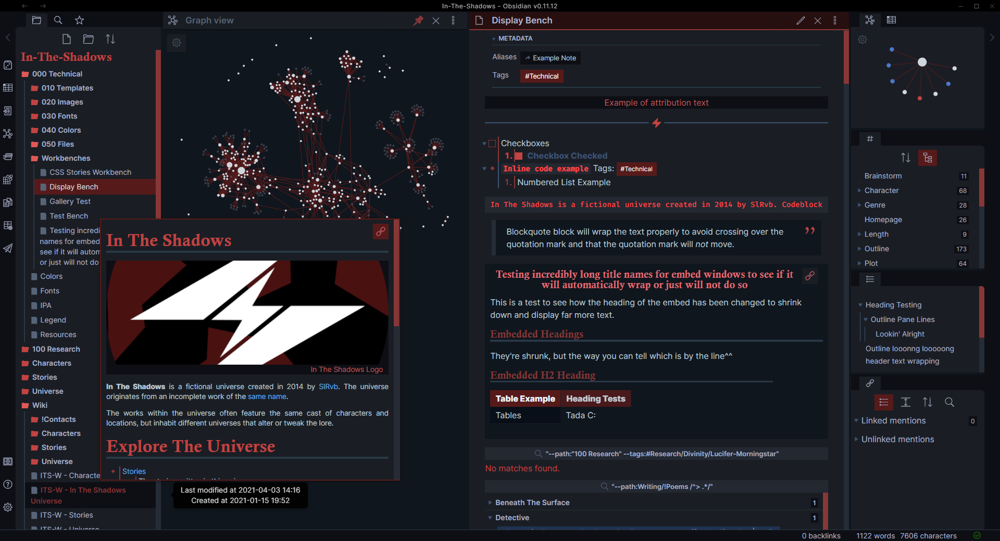
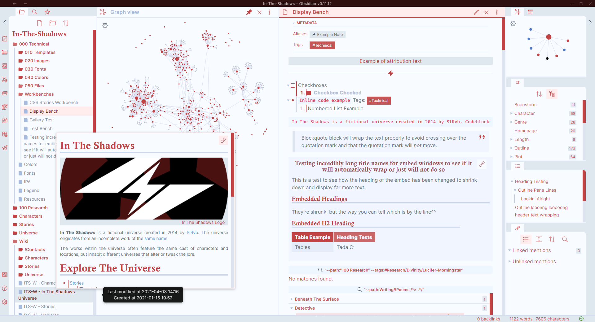

# ITS Theme
*By SlRvb*

Theme for my Obsidian Story Vault: ***In The Shadows.***

# Table of Contents
- [Features](#features)
- [Preview](#images)
- [Image Positions](#image-positions)
    - [Simplified Version](#simplified-version)
    - [Customizable Version](#customizable-version)
- [Embed Adjustmens *Coming Soon*](#embed-adjustments)

# Features
- Dark and Light mode compatible
- Colored Graph
- Squared Edges
- **Heading:**
    - **Underline**: spans across the page depending on the heading
    - **Font:** Calisto MT
    - **Embeded:** Embedded files have smaller headers and are 1 color
- Custom Horizontal line
    - *Credit:* [TriDiamond](https://forum.obsidian.md/t/meta-post-common-css-hacks/1978/223)
- Tag Pills (Rectangular)
- Metadata minimal style
- Checkboxes
    - *Credit:* [Kepano: Nicer Checkboxes](https://forum.obsidian.md/t/nicer-checkboxes/2238)
- **Images:**
    - Images Centered
    - **Zoom:** images enlarges upon clicking and holding it 
        - *Credit:* [Kepano: Image Zoom Click Hold To Expand Images](https://forum.obsidian.md/t/image-zoom-click-hold-to-expand-images/5164)
    - **Gallery/Masonry:** Side by side images.
        - Put `cssclass: img-grid` into frontmatter/YAML, separate by adding spaces
        - *Credit*: [Kepano: Display side by side image grid (CSS snippet)](https://forum.obsidian.md/t/display-side-by-side-image-grid-css-snippet/9359)
    - **Image Positions:** Move images to either left, right, center, change types, etc.
        - Inspired by: [Lithou's Image Flags](https://github.com/Lithou/Sandbox/blob/main/.obsidian/snippets/pub-Image%20Flags.css)
        - *If you use lithou's snippet, this feature does conflict with it.*
- **\<i>\</i>** for images or other files attributions
    - Adds a different color to text within it to differentiate it from other text
    - Centered to match image centering
    - Adding: `alt="left"` and `alt="right"` within it will push the attribute to left and right of the screen.
- **Blockquotes**
    - Soft background
    - Wider blockquote
    - Quotation marks added top right corner
- **Popover**
    - Larger Popover
    - Images fit within the popover window
    - Images are cropped in popover window
- **Line Relationships**
    - Bullet Points
        - *Credit:* [Lizardmenfromspace](https://forum.obsidian.md/t/meta-post-common-css-hacks/1978/2)
    - Outline Pane
    - Folder Navigation
    - Tag Pane 
        - *Note: Dot appears at bottom left corner. If it's too annoying add this snippet:*
        - ```|tag-container .tree-item-children {border-left: 0px;}```
- **Folder Navigation Icons**
    - Credit: [Deathau](https://forum.obsidian.md/t/meta-post-common-css-hacks/1978/109)
- **Text Wrapping**
    - Outline Pane
    - Tag Pane
    - File Explorer Sidebar
    - Embed Titles
    - Query Titles
- Embeds simplified
- Image Positions
- Embed Adjustments *Coming Soon*

*Folder Icons based on Folder Title not included, use this to add your own icons:*
```
.nav-folder-title[data-path="<Folder name here>"] .nav-folder-title-content::before {
  content: "<Emoji here> ";
  font-size:1.3em;
}
```

# Preview

## Darkmode


**Features**

**Edit Mode**


## Lightmode


**Features**

**Edit Mode**


# Image Positions
Obsidian internal images `![[]]` will change immediately, but for external images ``Obsidian needs to be refreshed: `ctrl + r` to see the changes.

### Clear

Example | Description |
---|---|
`![[image.png\|clear]]`| `clear` will allow that image to sit below another image<br>If it's on the same side instead of sitting in the middle of the page.

### Cover (Mostly for Customizable Version)

Example | Description |
---|---|
`![[image.png\|cover]]`| `cover` will resize the image maintaining aspect ratio and avoid stretching.

### Sizing (Mostly for Customizable Version)

Example | Description |
---|---|
`![[image.png\|loc\|sban\|200]]`| Place the `\|<numbers>` sizing at the *end* of the image line and it will shrink the image to that size.


## Simplified Version
### Left/Right

Example | Description |
---|---|
`![[image.png\|left]]`| `left` will move the image to the left.
`![[image.png\|right]`| `right` will move the image to the right.


### Banner

Example | Description |
---|---|
`![[image.png\|banner]]`| `banner` will crop the image height-wise to about 150px while setting the width to cover the entire page.
`![[image.png\|banner+small]]`| `banner+small` will crop the image height-wise to about 100px while setting the width to cover the entire page.
`![[image.png\|banner+tall]]`| `banner+tall` will crop the image height-wise to about 500px while setting the width to cover the entire page.


### Portrait

Example | Description |
---|---|
`![[image.png\|portrait]]`| `portrait` will crop the image width-wise to about 40% while setting the height to a standard of about 400px.
`![[image.png\|portrait+small]]`| `portrait+small` will crop the image width-wise to about 20% while setting the height to a standard of about 200px.
`![[image.png\|portrait+tall]]`| `portrait+tall` will crop the image width-wise to about 50% while setting the height to a standard of about 500px.


### Profile *Not fully working unless you use the `pc` property.*

Example | Description |
---|---|
`![[image.png\|profile]]`| `profile` will round the borders of the image to create a round image and size it to about 100px.
`![[image.png\|profile+medium]]`| `profile+medium` will round the borders of the image to create a round image and resize it to about 250px.


## Customizable Version
### Left/Right

Example | Description |
---|---|
`![[image.png\|locl]]`| `locl` will move the image to the left.
`![[image.png\|locr]]`| `locr` will move the image to the right.


### Inner Image Position

Example | Description |
---|---|
`![[image.png\|pl]]`| `pl` will move the inside of the image to the left.
`![[image.png\|pr]]`| `pr` will move the inside of the image to the right.
`![[image.png\|pt]]`| `pt` will move the inside of the image to the top.
`![[image.png\|pb]]`| `pb` will move the inside of the image to the bottom.
`![[image.png\|pc]]`| `pc` will move the inside of the image to the center.


### Inner Image Position Adjustments
These will inch the images around if the ^ above code isn't enough.

Example | Description |
---|---|
`![[image.png\|p+cr]]`| `p+cr` will move the inside of the image to the center right.
`![[image.png\|p+cl]]`| `p+cl` will move the inside of the image to the center left.
`![[image.png\|p+ct]]`| `p+ct` will move the inside of the image to the center top of the image.
`![[image.png\|p+cct]]`| `p+cct` will move the inside of the image to the center top, slightly higher than `p+ct`|
`![[image.png\|p+cb]]`| `p+cb` will move the inside of the image to the center bottom of the image.
`![[image.png\|p+ccb]]`| `p+ccb` will move the inside of the image to the center bottom, slightly higher than `p+cb`|

*Note that these side by side images are done with the .img-grid cssclass*

#### Left/Right Example


#### Top/Bottom Example


### Sizing

Example | Description |
---|---|
`![[image.png\|htiny]]`|`htiny` will resize the image to about 100px in height.
`![[image.png\|hsmall]]`| `hsmall` will resize the image to about 200px in height.
`![[image.png\|hs-med]]`| `hs-med` will resize the image to about 300px in height.
`![[image.png\|hm-sm]]`| `hm-sm` will resize the image to about 400px in height.
`![[image.png\|hmed]]`| `hmed` will resize the image to about 500px in height.
`![[image.png\|hm-tl]]`| `hm-tl` will resize the image to about 600px in height.
`![[image.png\|htall]]`| `htall` will resize the image to about 700px in height.
||
`![[image.png\|wtiny]]`| `wtiny` will resize the image to about 100px in width.
`![[image.png\|wsmall]]`| `wsmall` will resize the image to about 200px in width.
`![[image.png\|ws-med]]`| `ws-med` will resize the image to about 300px in width.
`![[image.png\|wm-sm]]`| `wm-sm` will resize the image to about 400px in width.
`![[image.png\|wmed]]`| `wmed` will resize the image to about 500px in width.
`![[image.png\|wm-tl]]`| `wm-tl` will resize the image to about 600px in width.
`![[image.png\|wtall]]`| `wtall` will resize the image to about 700px in width.